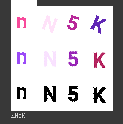
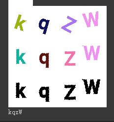
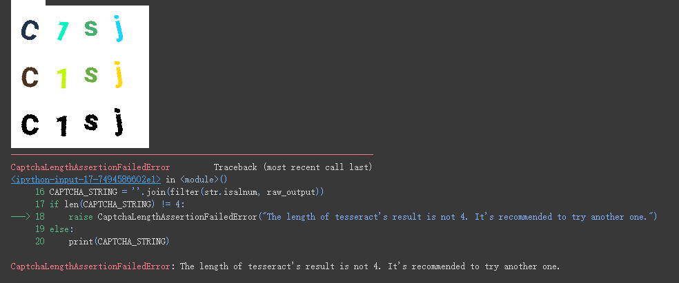
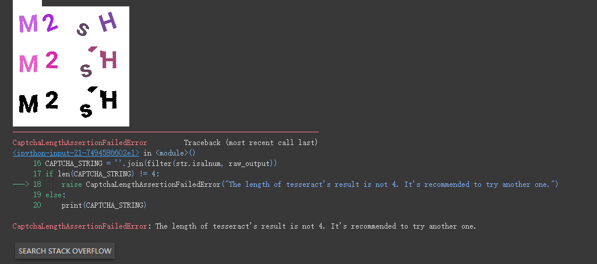

# tongji-ids-captcha-crack

Crack Tongji's new ids captcha!

Estimated successful rate is around about 75%. See examples for what kind of alpnums it can deal with. or go into colab to try it on your own!

## Prerequisites

Notebook version needs a Colab.

``` bash
sudo apt install tesseract-ocr
pip install pytesseract
```

## Examples

### Successful





### Unsuccessful





